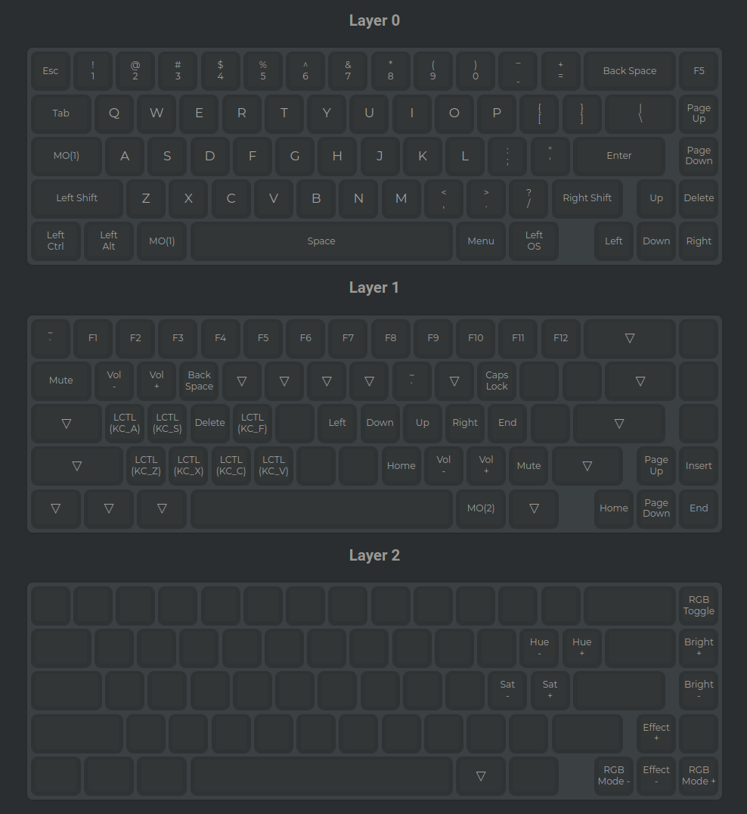

## Using the official QMK firmware

This is the latest keymap used in my black version of GMMK 2 Compact (65%), ANSI version. It was generated using the [QMK Configurator](https://config.qmk.fm/#/gmmk/pro/ansi/LAYOUT). The reason I used this is that the previous one (GloriousThrall) was having some issues with one of the two keyboards.

Following my guide of setting up the official QMK firmware, and just adapted the `udev` rules, as documented in my guide for [GMMK 2 Compact using GloriousThrall QMK](https://gloriousforum.com/t/qmk-install-keymap-guide-for-gmmk-2-compact-on-ubuntu-distros/14529).

 

### Keymaps

The layout is the following:

