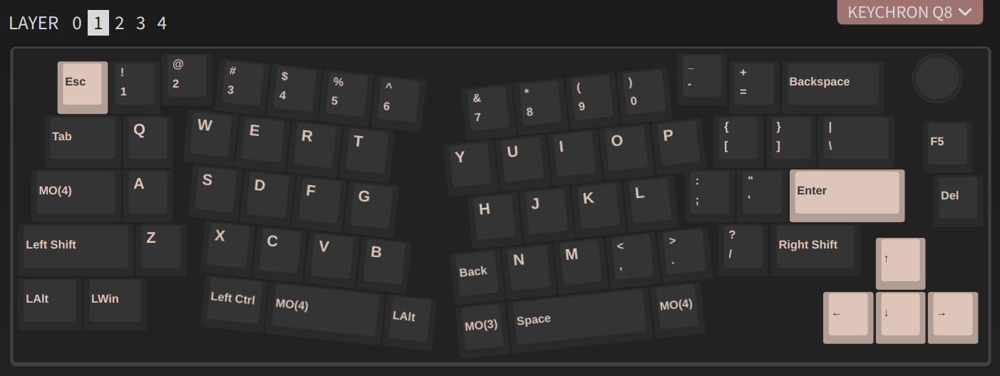

## Keychron Q8 :: My Layout #3

This is based on the previous one, that is Layout 2, with one addition:

- Left space (MO(4)) + Right Space (Space)    = Win + Space   (used for keyboard layout toggle in Linux)

## Saved Layout

The layout is saved as [`keychron_q8_layout_3.json`](./keychron_q8_layout_3.json) file.
