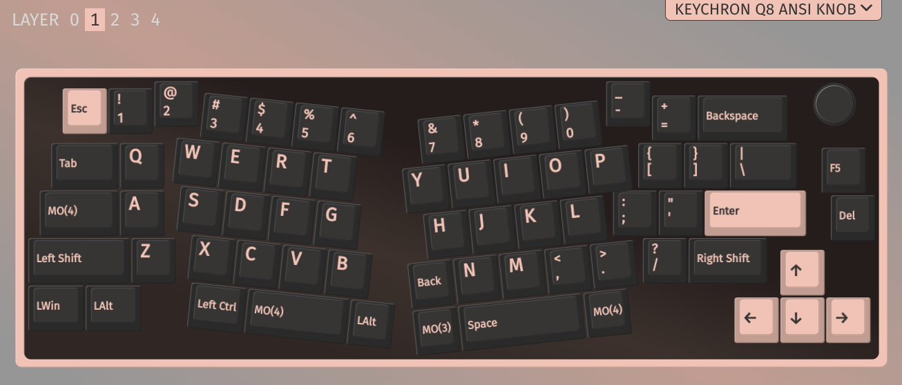
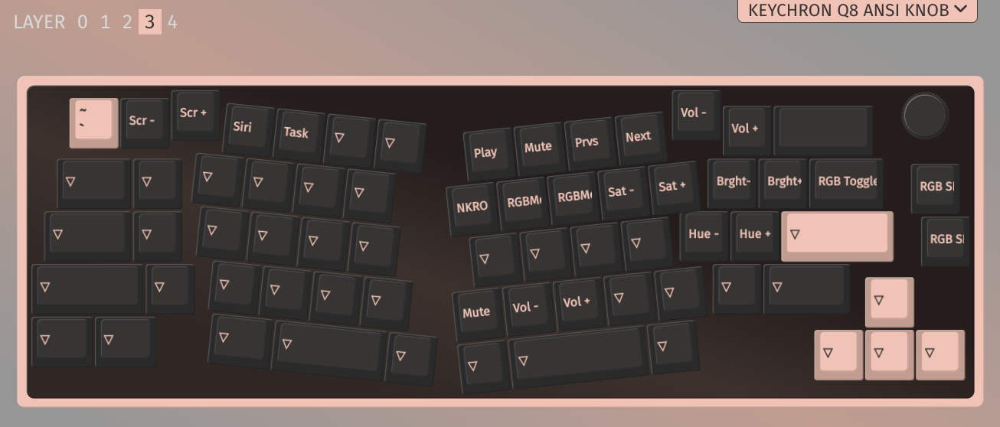
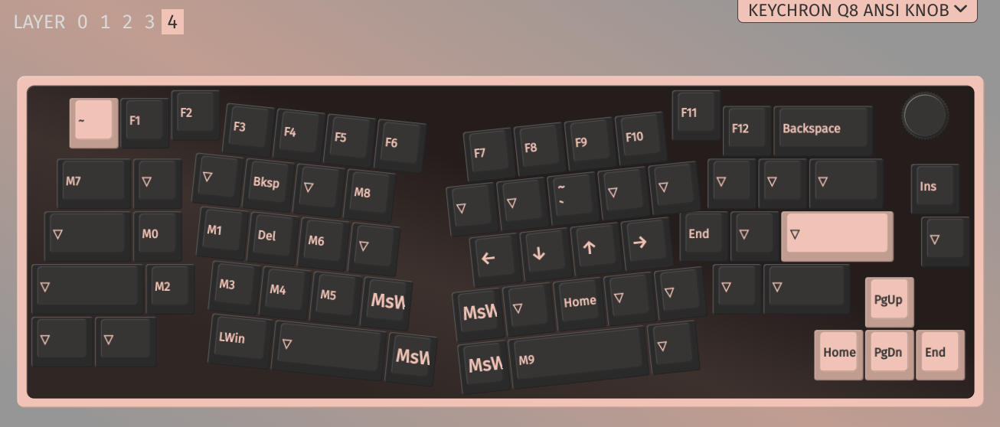

## Keychron Q8 :: My Layout #4

This is based on the previous one, that is Layout 3, with these additions:

-   on layer 1: Left Alt and Left Win switched
-   on layer 3: removed BL Toggle (from Backspace key)

 

## Saved Layout

The layout is saved as [`keychron_q8_ansi_knob_layout_4.json`](./keychron_q8_ansi_knob_layout_4.json) file.

 

### Macros

The macro being set are:

-   M0 is `{KC_LCTL,KC_A}`
-   M1 is `{KC_LCTL,KC_S}`
-   M2 is `{KC_LCTL,KC_Z}`
-   M3 is `{KC_LCTL,KC_X}`
-   M4 is `{KC_LCTL,KC_C}`
-   M5 is `{KC_LCTL,KC_V}`
-   M6 is `{KC_LCTL,KC_F}`
-   M7 is `{+KC_LALT}{KC_TAB}`
    -   It almost works as Alt+Tab, except that after selecting the item, you have to press Alt to release it and have that selected item as active and in front.
-   M8 is `{KC_LCTL,KC_T}`
-   M9 is `{KC_LGUI,KC_SPC}`
