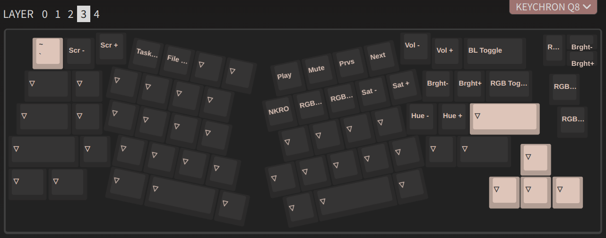

# Keychron Q8 - Layout(s)

This place contains my layout(s) for Keychron Q8, set using VIA. 
For the details on VIA install and setup, checkout [the product homepage](https://www.keychron.com/products/keychron-q8-alice-layout-qmk-custom-mechanical-keyboard).

 

## The Procedure

Just to remember:
1. Open VIA.
2. On `Design` tab, drag-n-drop the [Q8_US_ANSI_Knob_V1.5](./Q8_US_ANSI_Knob_V1.5.json) file into it.
3. On `Configure` tab, go to `Save + Load` and click on _Load_ to load the [saved layout's JSON file](layout_3/keychron_q8_layout_3.json).

 

## The Current Layout

The current layout ([#3](layout_3/readme.md)) has these layers (relevant for Linux/Win) defined as follows:

