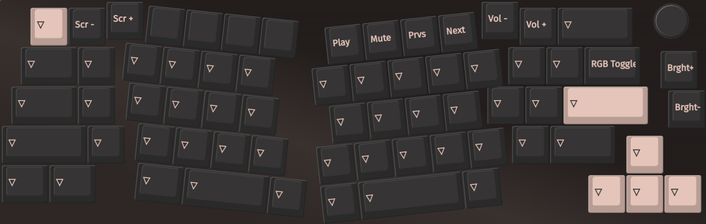

## My Layout for Keychron V8

The Linux/Win (non macOS) layers are as folows:

### Macros

The macro being set are:

- M0 is `{KC_LCTL,KC_A}`
- M1 is `{KC_LCTL,KC_S}`
- M2 is `{KC_LCTL,KC_Z}`
- M3 is `{KC_LCTL,KC_X}`
- M4 is `{KC_LCTL,KC_C}`
- M5 is `{KC_LCTL,KC_V}`
- M6 is `{KC_LALT,KC_F}`
- M7 is `{KC_LALT,KC_TAB}`
- M8 is *none*
- M9 is `{KC_LGUI,KC_SPC}`

