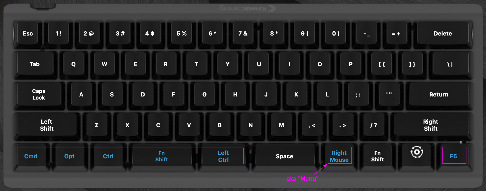
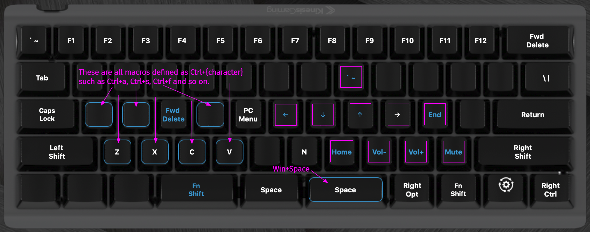

## Kinesis TKO

Copied into [kinesis_tko_backup_2023-08-01](./kinesis_tko_backup_2023-08-01/) as backup the main settings that exist in its v-drive.

### The (Key Mapping) Layers

This keyboard has two layers: a "top" one, and a "fn" one. Here is the visual representation of them (as presented in the SmartSet App):

##### Top layer

##### Fn layer

 

### Manuals

Included here are also the two main manuals:

-   [User Manual](./manuals/TKO-User-Manual-Jan-13-2021.pdf)
-   [Direct Programming Guide](./manuals/TKO-Direct-Programming-Guide-Oct-5-2020.pdf)

 

### Refs

-   [TKO Support](https://gaming.kinesis-ergo.com/tko-support/) page

 
