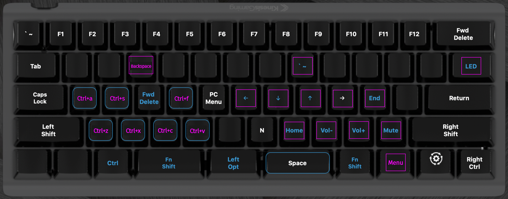

## Kinesis TKO

As a backup, the main settings (at least the 1st layout) were copied from its v-drive into [kinesis_tko_backup](./kinesis_tko_backup/) folder.

 

### The (Key Mapping) Layers

This keyboard has two layers: a "top" one, and a "fn" one. Here is the visual representation of them (as presented in the SmartSet App):

##### Top layer

##### Fn layer

 

### Manuals

Included here are also the two main manuals:

-   [User Manual](./manuals/TKO-User-Manual-Jan-13-2021.pdf)
-   [Direct Programming Guide](./manuals/TKO-Direct-Programming-Guide-Oct-5-2020.pdf)

 

### Refs

-   [TKO Support](https://gaming.kinesis-ergo.com/tko-support/) page

 
