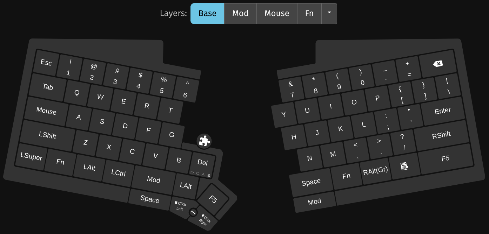
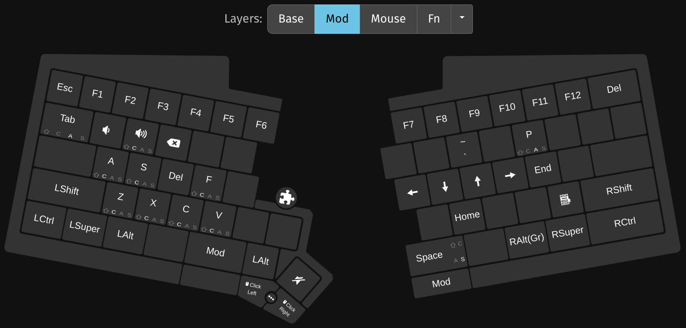
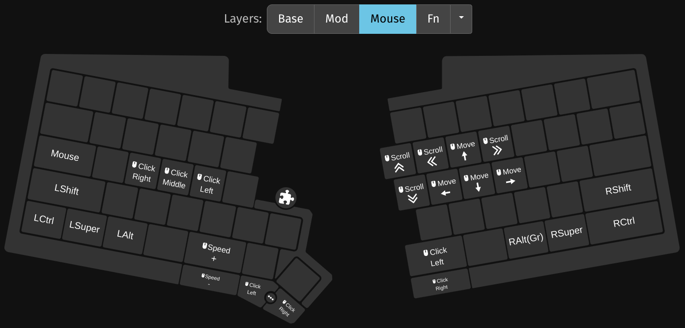
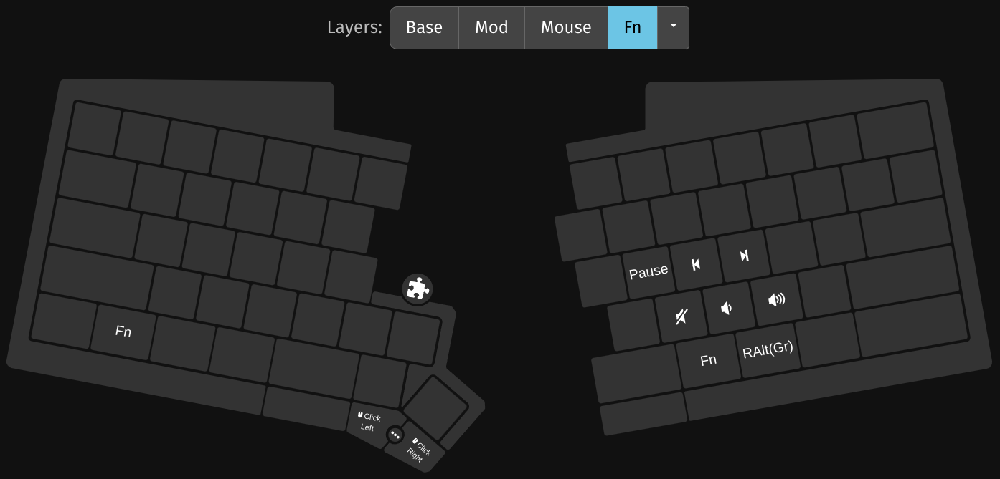

## My UHK v1 Configuration

This is my Ultimate Hacking Keyboard (UHK) v1 configuration, exported from the UHK Agent tool as `UserConfiguration.json` file.

 

### The Layers

And here are the keymaps on each of the layers:

